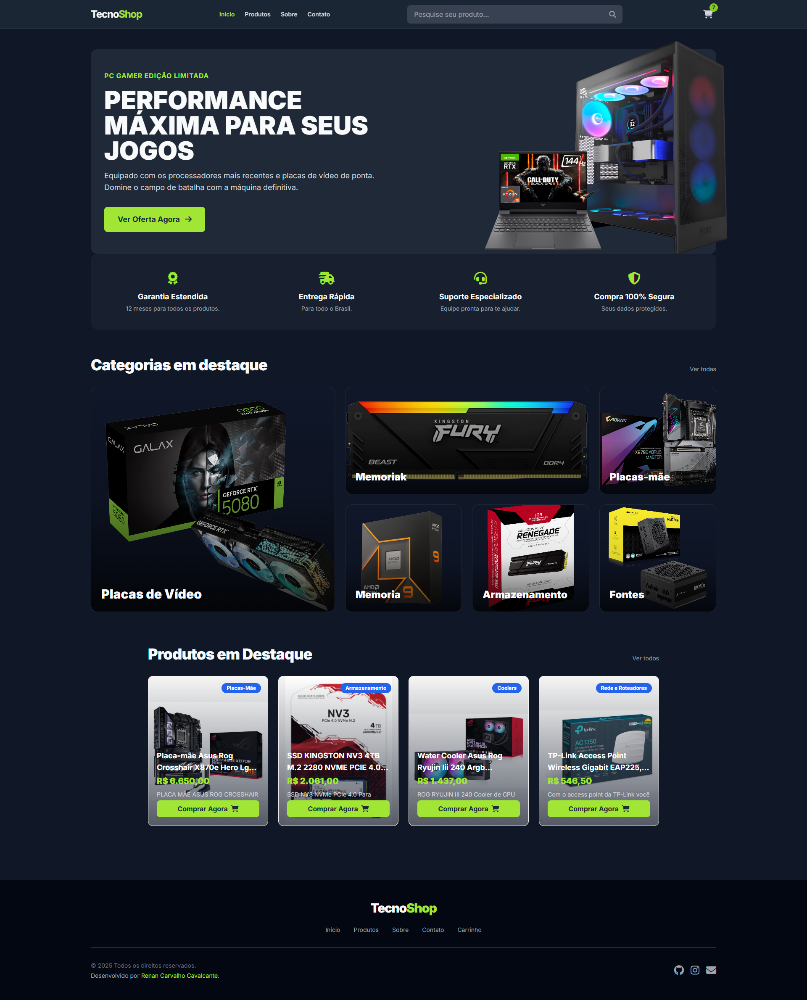

# TecnoStoreBR  
(Plataforma de E-commerce de Hardware)

Um projeto de e-commerce simulado que demonstra habilidades em desenvolvimento, manipulação de dados e operações de TI.

<!-- Badges -->
     
  

---

## 📖 Índice
- 📝 [Sobre o Projeto](#-sobre-o-projeto)  
- 👨‍💻 [Sobre Mim](#-sobre-mim)  
- 🚀 [Funcionalidades do Site](#-funcionalidades-do-site)  
- 🛠️ [Tecnologias Utilizadas](#-tecnologias-utilizadas)  
- 📊 [Exemplo de Lógica de Negócio](#-exemplo-de-lógica-de-negócio)  
- 📜 [Licença](#-licença)  
- 📫 [Contato](#-contato)  

---

## 📝 Sobre o Projeto
Este repositório contém o código-fonte da TecnoStoreBR, uma plataforma de e-commerce dinâmica construída para simular operações reais de um marketplace de hardware de computadores.

Este projeto não é apenas uma aplicação front-end simples; é uma demonstração abrangente de como integrar lógicas de negócio, processos de limpeza de dados e conhecimento operacional em um produto web funcional. Ele serve como uma peça de portfólio para exibir minhas habilidades em desenvolvimento web, gerenciamento de dados e minha experiência prática na indústria de hardware e TI.

---

## 👨‍💻 Sobre Mim
Sou programador de sistemas, trabalhando em tempo integral em uma grande varejista de hardware desde fevereiro de 2023. Minha função combina desenvolvimento com operações críticas de TI e negócios, o que me proporciona uma perspectiva única na construção de aplicações robustas e práticas.

Minhas principais responsabilidades incluem:

- 🧾 **Emissão de Notas Fiscais Eletrônicas (NF-e):** Gerenciamento da geração e administração de documentos fiscais.  
- 🛒 **Gestão de Marketplace:** Administração do nosso anuncio e vendas do nossos produtos em diversas plataformas online, incluindo sincronização de dados.  
- 💻 **Suporte de TI:** Fornecimento de suporte técnico, solucionando problemas no Excel, sistemas internos e implementando melhorias operacionais.

Essa experiência foi fundamental para moldar a lógica deste projeto de e-commerce. As funcionalidades implementadas são diretamente inspiradas nos desafios e soluções com os quais trabalho diariamente.

---

## 🚀 Funcionalidades do Site
A plataforma foi desenvolvida com foco na experiência do usuário e na simulação de um ambiente de e-commerce real. As principais funções implementadas são:

### Catálogo Dinâmico e Filtrável:
- A página de produtos carrega o catálogo completo do Firebase e o exibe de forma paginada.  
- O usuário pode filtrar os produtos por categoria e por disponibilidade em estoque.  
- A busca é inteligente, permitindo pesquisar por nome, SKU ou categoria, atualizando a listagem em tempo real.

### Página de Produto Detalhada:
- Ao clicar em um produto, o site busca os dados específicos daquele SKU no Firebase.  
- A página exibe uma galeria de imagens interativa com miniaturas, zoom e navegação.  
- O usuário pode selecionar a quantidade desejada antes de adicionar ao carrinho.

### Carrinho de Compras Persistente:
- O carrinho de compras utiliza o `localStorage` do navegador para salvar os produtos, mantendo-os mesmo que o usuário feche a aba.  
- É possível alterar a quantidade ou remover itens diretamente do carrinho, com o subtotal sendo recalculado automaticamente.  
- A finalização do pedido gera uma mensagem de orçamento formatada para o WhatsApp, contendo todos os detalhes dos produtos e a forma de pagamento selecionada.

### Notificações Visuais:
- Ao adicionar um item ao carrinho, uma notificação animada aparece na tela, confirmando a ação e mostrando o produto adicionado, melhorando a experiência do usuário.

---

## 🛠️ Tecnologias Utilizadas
**Frontend:** HTML5, CSS3 (com Tailwind CSS), JavaScript (ES6+)  
**Backend & Banco de Dados:** Firebase Realtime Database (como BaaS)  
**APIs:** Firebase REST API

**Processamento de Dados & Lógica de Negócio (Simulado):**  
-  Sheets: `ARRAYFORMULA`, `SEERRO`, `PROCV`, `MAP`, `SE`, `LET`, `LAMBDA`  
- Expressões Regulares (Regex): `REGEXREPLACE`, `REGEXEXTRACT` para limpeza de dados.

---

## 📊 Exemplo de Lógica de Negócio
A inteligência do projeto reside na camada de processamento de dados (simulada via planilhas). Fórmulas avançadas foram usadas para automatizar tarefas críticas e garantir a integridade do catálogo, como:

- **Validação de Estoque Multi-Fonte:** Lógicas que cruzam dados de diferentes fontes para determinar a disponibilidade real do produto, priorizando a fonte mais confiável para evitar a venda de itens indisponíveis.  
- **Mapeamento e Padronização de Categorias:** Funções que extraem a categoria correta de textos não estruturados e a padronizam para garantir uma navegação consistente no site.  
- **Limpeza Avançada de Descrições:** Aplicação de Regex para remover automaticamente textos promocionais, termos institucionais e códigos HTML das descrições, garantindo um conteúdo limpo e focado no cliente.  
- **Consolidação e Filtragem de Imagens:** Automação para agregar múltiplos links de imagens de um produto em uma lista única, filtrando fontes específicas e descartando links inválidos para alimentar a galeria de fotos.

---

## 📜 Licença
Este projeto é de propriedade intelectual de Renan Carvalho Cavalcante e possui todos os direitos reservados.

É expressamente proibido:

- Copiar, clonar, distribuir ou reproduzir o código-fonte, no todo ou em parte.  
- Modificar, adaptar ou criar trabalhos derivados a partir deste código.  
- Utilizar este projeto, ou partes dele, para quaisquer fins (comerciais ou não comerciais) sem a autorização prévia e explícita do autor.

Este repositório existe exclusivamente para fins de ensino apredizaddo e de habilidades e como portfólio. As funcionalidades aqui desenvolvidas são exemplos do meu trabalho e não podem ser replicadas sem permissão.

---

## 📫 Contato
- **LinkedIn:** [Renan Carvalho Cavalcante](https://www.linkedin.com/in/renan-carvalho-cavalcante-74095b237/)  
- **GitHub:** [@renanratinh0](https://github.com/renanratinh0)  
- **Email:** renanratinho00@gmail.com

Encorajo recrutadores, desenvolvedores e entusiastas de hardware a explorarem este repositório. Ele é um exemplo da capacidade de conectar operações de TI práticas com o desenvolvimento web moderno, entregando soluções que não são apenas tecnicamente sólidas, mas também alinhadas às necessidades do negócio.
